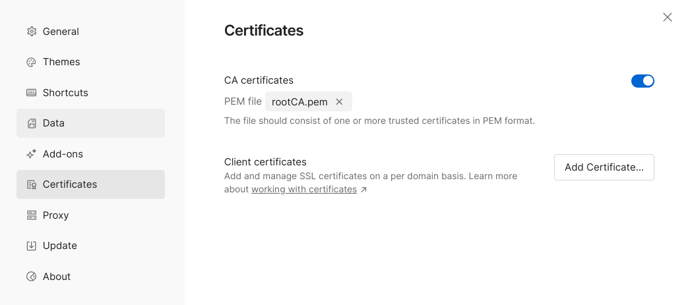

# Traefik v2 HTTPS

[![Software License][ico-license]][link-license]

## Introduction

`Traefik` on localhost with HTTPS support, using **.test** domain. This project creates different services
containers to use for your projects on local like MySQL, MariaDB, Redis, Memcached or another.

### Requirements

- [Docker](https://www.docker.com)
- [Docker Compose](https://docs.docker.com/compose/install)
- [MKCert](https://github.com/FiloSottile/mkcert)

### WARNING FOR MICROSOFT WINDOWS!!!

```shell
# Require this environment var
SET COMPOSE_CONVERT_WINDOWS_PATHS=1
```

## How to start

```shell
# Clone
git clone https://github.com/lalcebo/docker-traefik-https.git && cd docker-traefik-https

# If it's the first install, run
geeko -i

# Now, start containers
# NOTE: You can inspect the .env file before and change any values you want
geeko -s

# For help, run
geeko -h
```

## Hosts & Dashboard

```shell
# dnsmasq server test
dig @127.0.0.1 +noall +answer +stats whatever.test
```

* Set your nameserver to `127.0.0.1`, the dnsmasq server will resolve `*.test` automatic, for any external domains it will use Cloudflare nameserver.
* You can now go to your browser at [proxy.test](https://proxy.test) for `Træfik` dashboard, enjoy 🚀!

## Postman

Add a custom CA Certificates setting using `rootCA.pem` file. To know it location run `mkcert --CAROOT`



## Build Images

### Requirements

- [Buildx](https://docs.docker.com/build/install-buildx/)

```shell
# If it's the first build, run
docker run --privileged --rm tonistiigi/binfmt --install all
docker buildx create --name multiarch --driver docker-container --use

# Now, build images
./builds/make.sh
```

## About

I'll try to maintain this project as simple as possible, but Pull Requests are welcomed!

## License

The MIT License (MIT). Please see [License File][link-license] for more information.

[ico-license]: https://img.shields.io/badge/license-MIT-brightgreen.svg?style=for-the-badge&color=blue

[link-license]: LICENSE
